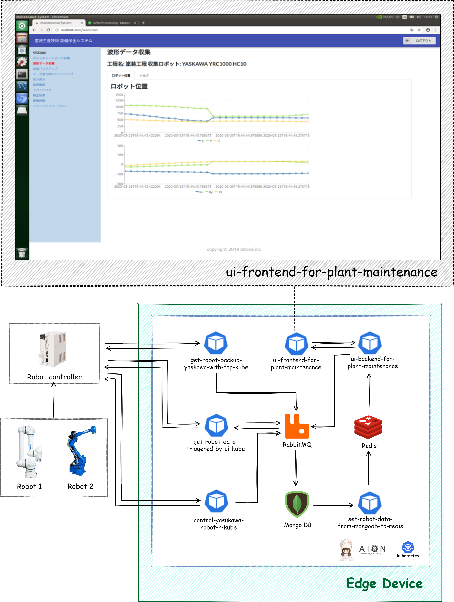

# plant-maintenance-system　　
plant-maintenance-system は、エッジコンピューティング環境において、ロボットコントローラやPLCからデータを取得し、ロボット自身では監視しきれない稼働情報、異常情報や、設備保全変更履歴などをUIフロントエンドに表示するシステムです。

## 動作環境

* OS: Linux  
* CPU: ARM/AMD/Intel  
* aion-core および 関連リソース  

## plant-maintenance-system のアーキテクチャ   
以下の図はplant-maintenance-systemのアーキテクチャ図です。  

## plant-maintenance-system に含まれるリソース
work-detection-system には、以下の マイクロサービス等 のリソースが含まれます。  
・[aion-core](https://github.com/latonaio/aion-core)および関連リソース      
・[ui-frontend-for-maintenance](https://github.com/latonaio/ui-frontend-for-maintenance)   
・[ui-backend-for-maintenance](https://github.com/latonaio/ui-backend-for-maintenance)   
・get-robot-backup-yaskawa-with-ftp-kube  
・[get-robot-data-triggered-by-ui-kube](https://github.com/latonaio/get-robot-data-triggered-by-ui-kube)    
・[control-yaskawa-robot-r-kube](https://github.com/latonaio/control-yaskawa-robot-r-kube)    （※1）  
・set-robot-data-from-mongodb-to-redis  

（※1）のマイクロサービスは、次のマイクロサービスに代替されることができます。  
[control-jtekt-plc-r-kube](https://github.com/latonaio/control-jtekt-plc-r-kube), [control-mitsubishi-plc-r-kube](https://github.com/latonaio/control-mitsubishi-plc-r-kube)  

